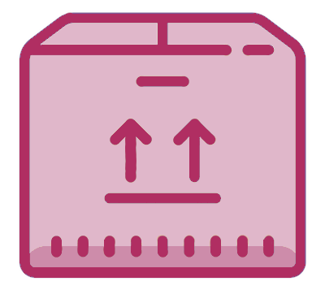
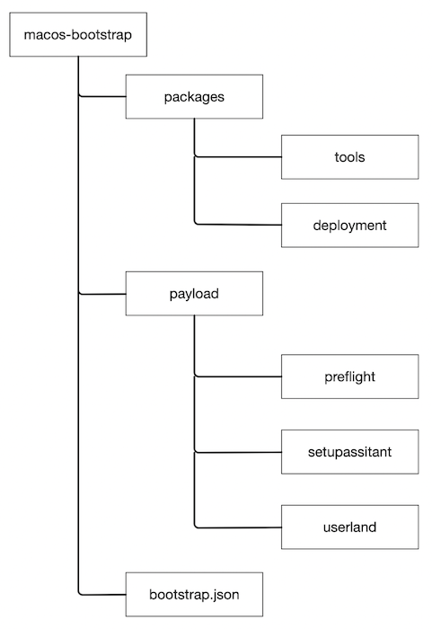
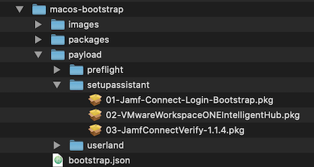

# Bootstrap Package Repo




\* Image borrow from: [here](https://github.com/erikng/installapplications#how-this-process-works)  

This repo is my attempt at learning how the Boostrap process works in macOS using the installapplications mechanism created by [erikng](https://github.com/erikng).

The packages in the this repository are being used to feed MacOS DEP deployments coming from WorkspaceONE.


## Basic Repo Structure




## How the installapplications process works

During a DEP SetupAssistant workflow (with a supported MDM), the following will happen:

1. MDM will send a push request utilizing InstallApplication to inform the device of a package installation.
1. InstallApplications (this tool) will install and load its LaunchDaemon.
1. InstallApplications (this tool) will install and load its LaunchAgent if in the proper context (installed outside of SetupAssistant).
1. InstallApplications will begin to install your Setup Assistant packages (if configured) during the SetupAssistant.
1. If userland packages are configured, InstallApplications will wait until the user is in their active session before installing.
1. InstallApplications will gracefully exit and kill its process.

\* Copied from the explanation in the [installapplications repo](https://github.com/erikng/installapplications#how-this-process-works). 


## Logging

All root actions are logged to `/private/var/log/InstallApplications/installapplications.log` as well as through NSLog. You can open up Console.app and search for InstallApplications to bring up all of the events.

All user actions are logged to `/var/tmp/InstallApplications/installapplications.user.log` as well as through NSLog. You can open up Console.app and search for InstallApplications to bring up all of the events.


## Package Build Steps

1. Download this repository to your local Mac and place it on your Desktop for easy access. This will be the starting point for building out the bootstrap package. This guide will refer to the `Desktop` folder and the download location for the duration of this guide.

    You can use this [download link](https://github.com/captam3rica/macos-bootstrap/archive/master.zip)

2. Provisioning packages

    Obtain the packages that need to be installed as a part of the device provisioning process. These packages will be uploaded to a central repository for distribution. In this example we are utilizing GitHub for package distrobution.

	This guide will be utilizing the 
	
	- [WSO Hub application](https://awagent.com)
	- Jamf Connect Login
	- Jamf Connet Notify mechanism (contained in the JCL payload)
	- Jamf Connect Verify.

	For details on packaging some of the above packages see [Packaging the Apps in the Payload](https://github.com/captam3rica/macos-bootstrap#packaging-the-apps-in-the-payload)

3. Download the following tools.

    These tools are used in the bootstrap package build process. You can use the ones included in this repo (**packages > tools**) or you can download them directly from their respective repos by following the links below.

	- [InstallApplications](https://github.com/erikng/installapplications)
	- *[Packages](http://s.sudre.free.fr/Software/Packages/about.html)
	- [munkipkg](https://github.com/munki/munki-pkg) - for package creation
	- *[Apple Developer](https://developer.apple.com) cert - It must be a certificate that can be used to install packages (Example: Developer ID Installer: Matt Wilson (XXXXXXXXXXXX)).

    \* NOT Included in this repo

4. Build the embedded python framework

    To reduce the size of this git repository, you must create your own embedded Python. To do this, simply run the `./build_python_framework.sh` script from where you downloaded this repository (**Desktop > macos-bootstrap > packages > tools > installapplications-\<version>**).
    
    Just double-click on the `build_python_framework` to run it.
    
    Tested on macOS Catalina.
    
    ```sh
    # Example: cd Desktop/macos-bootstrap/packages/tools/installapplications-2.0rc4
    ./build_python_framework
    Enter password:

    Cloning relocatable-python tool from github...
    Cloning into '/tmp/relocatable-python-git'...
    remote: Enumerating objects: 20, done.
    remote: Counting objects: 100% (20/20), done.
    remote: Compressing objects: 100% (14/14), done.
    remote: Total 70 (delta 7), reused 16 (delta 6), pack-reused 50
    Unpacking objects: 100% (70/70), done.
    Downloading https://www.python.org/ftp/python/3.8.0/python-3.8.0-macosx10.9.pkg...
    
    ...
    
    Done!
    Customized, relocatable framework is at ./Python.framework
    Moving Python.framework to InstallApplications payload folder
    ```
    
    \* Python build instructions modified from [erikng/installapplications](https://github.com/erikng/installapplications#building-embedded-python-framework)

5. Build the installapplications `bootstrap.json` file.

    Navigate to **packages > tools > installapplications-\<version>** and locate the `generatejson.py` script.

    Using `generatejson.py` file add the necessary flags and file paths for each of the packages that you will be installing during device setup. The command that I used can be found below.
    
    You can either drag the script file into a Terminal window or from within a Terminal session navigate to the directory using the `cd` command.
    
    You can pass an unlimited amount of --item arguments, each one with the following meta-variables. Please note that currently all of these meta-variables are **_REQUIRED_**

    - *item-name* - required, sets the display name that will show in DEPNotify
    - *item-path* - required, path on the local disk to the item you want to include
    - *item-stage* - required, defaults to userland if not specified
    - *item-type* - required, generatejson will detect package vs script. Scripts default to rootscript, so pass "userscript" to this variable if your item is a userscript.
    - *item-url* - required, if --base-url is set generatejson will auto-generate the URL as base-url/stage/item-file-name. You can override this automatic generation by passing a URL to the item here.
    - *script-do-not-wait* - required, only applies to userscript and rootscript item-types. Defaults to false.
	
	Example command:
	
	```sh
	python generatejson.py --base-url https://github.com --output ~/Desktop \
    --item \
    item-name='JamfConnectLogin' \
    item-path='/Users/<your_username>/Desktop/macos-bootstrap/payload/setupassistant/01-jamf-connect-login-bootstrap.pkg' \
    item-stage='setupassistant' \
    item-type='package' \
    item-url='https://raw.githubusercontent.com/captam3rica/macos-bootstrap/master/payload/setupassistant/01-jamf-connect-login-bootstrap.pkg' \
    script-do-not-wait=False \
	```
    
    Once the `bootstrap.json` file is created it should look similar to the below.
    
	```json
	{
      "preflight": [],
      "setupassistant": [
        {
          "file": "/Library/installapplications/01-jamf-connect-login-bootstrap.pkg",
          "hash": "2db4991dbade0c525e149e1de647991c2aea92575d0b54733cdfea6c5285d20b",
          "name": "JamfConnectLogin",
          "packageid": "com.captam3rica.Jamf-Connect-Login-Bootstrap",
          "type": "package",
          "url": "https://raw.githubusercontent.com/captam3rica/macos-bootstrap/master/payload/setupassistant/01-jamf-connect-login-bootstrap.pkg",
          "version": "1.5"
        }
      ],
      "userland": []
    }
	```

6. Upload files and packages

    Upload all payload installation packages (01-payload-package, 02-payload-package, n-payload-package) and `bootstrap.json` file that you just created to an external file share such as GitHub, BitBucket, GitLab, or S3. Be sure to upload the payload packages to the appropriate stage based upon when the packages should be installed (preflight, setupassistant, userland).

	The file structure that I have created is as follows:
	
	
	
7. Modify the `--jsonurl` parameter in the `com.erikng.installapplications.plist` LaunchDaemon file to reflect the URL where the `bootstrap.json` file resides in the external repository.

	**packages > tools > installapplications-\<version> > payload > Library > LaunchDaemons**
	
	```xml
    <string>--jsonurl</string>
    <string>hhttps://raw.githubusercontent.com/captam3rica/macos-bootstrap/blob/master/bootstrap.json</string>
	```
	
8. If installing DEPNotify, uncomment the relative command arguments in the `com.erikng.installapplications.plist` LaunchDaemon file as well. (More info [here](https://github.com/erikng/installapplications#depnotify))

9. Modify `build-info.json`

    **packages > building > installapplications-\<version> > build-info.json**

    Navigate to the installapplications directory and open the `build-info.json` file with a text editor. Add the developer ID name (Developer ID Installer: Your Name (XXXXXXXXXXX)) to the `identity` key in the installapplications folder. Save the file.

    One way to grab the certificate information is by opening **Keychain Access.app** and searching for `Developer ID Installer` in your login keychain. 

	```json
	{
        "distribution_style": true,
        "identifier": "com.erikng.installapplications",
        "install_location": "/",
        "name": "InstallApplications-${version}.pkg",
        "ownership": "recommended",
        "postinstall_action": "none",
        "signing_info": {
            "identity": "Developer ID Installer: Matt Wilson (XXXXXXXXXXX)",
            "timestamp": true
        },
        "suppress_bundle_relocation": true,
        "version": "2.0"
    }
	```

10. Build the InstallApplications package using `munkipkg`

    **packages > tools > munki-pkg-master > munkipkg**

	The easiest options is to drag the `munkipkg.py` binary into a Terminal window. Then, drag the installapplications folder into the Terminal window as well. munkipkg will create a `build` folder containing the distributable package in the installapplications folder.
	
	```
	./munkipkg Desktop/macos-bootstrap/packages/tools/installapplications-2.0rc4 
    ```
    
    Sample output ...
    
    ```
    pkgbuild: Inferring bundle components from contents of /Desktop/macos-bootstrap/packages/tools/installapplications-2.0rc4/payload
    pkgbuild: Writing new component property list to /var/folders/kl/040bdqhs441dd1dt_99fzppw0000gp/T/tmp6H8fNE/component.plist
    pkgbuild: Reading components from /var/folders/kl/040bdqhs441dd1dt_99fzppw0000gp/T/tmp6H8fNE/component.plist
    pkgbuild: Adding component at Library/installapplications/Python.framework/Versions/3.8/Resources/Python.app
    pkgbuild: Adding component at Library/installapplications/Python.framework
    pkgbuild: Adding top-level preinstall script
    pkgbuild: Adding top-level postinstall script
    pkgbuild: Wrote package to /Desktop/macos-bootstrap/packages/tools/installapplications-2.0rc4/build/InstallApplications-2.0.pkg
    munkipkg: Adding package signing info to command
    productbuild: Using timestamp authority for signature
    productbuild: Signing product with identity "Developer ID Installer: Matthew Wilson (XXXXXXX)" from keychain /Users/captam3rica/Library/Keychains/login.keychain-db
    productbuild: Adding certificate "Developer ID Certification Authority"
    productbuild: Adding certificate "Apple Root CA"
    productbuild: Wrote product to /Desktop/macos-bootstrap/packages/tools/installapplications-2.0rc4/build/Dist-InstallApplications-2.0.pkg
    munkipkg: Removing component package /Desktop/macos-bootstrap/packages/tools/installapplications-2.0rc4/build/InstallApplications-2.0.pkg
    munkipkg: Renaming distribution package /Desktop/macos-bootstrap/packages/tools/installapplications-2.0rc4/build/Dist-InstallApplications-2.0.pkg to /Desktop/macos-bootstrap/packages/tools/installapplications-2.0rc4/build/InstallApplications-2.0.pkg
    ```

11. Upload the isntallapplications package to the WorkspaceONE UEM console.


## Dependencies

- InstallApplications
- Apple Developer Certificate for signing the bootstrap package.


## Packaging the Apps in the Payload

- **COMING SOON ...**


## CHANGELOG

- See [CHANGELOG.md](https://github.com/captam3rica/bootstrap/blob/master/CHANGELOG.md)

## Resources

- https://github.com/erikng/installapplications
- https://code.vmware.com/samples/2697/macos-bootstrap-package
- https://github.com/vmware-samples/AirWatch-samples/tree/master/macOS-Samples/BootstrapPackage
- https://www.youtube.com/watch?time_continue=2&v=l5uTxnHB_kI
- [DEPNotify Commands](https://gitlab.com/Mactroll/DEPNotify#commands)

